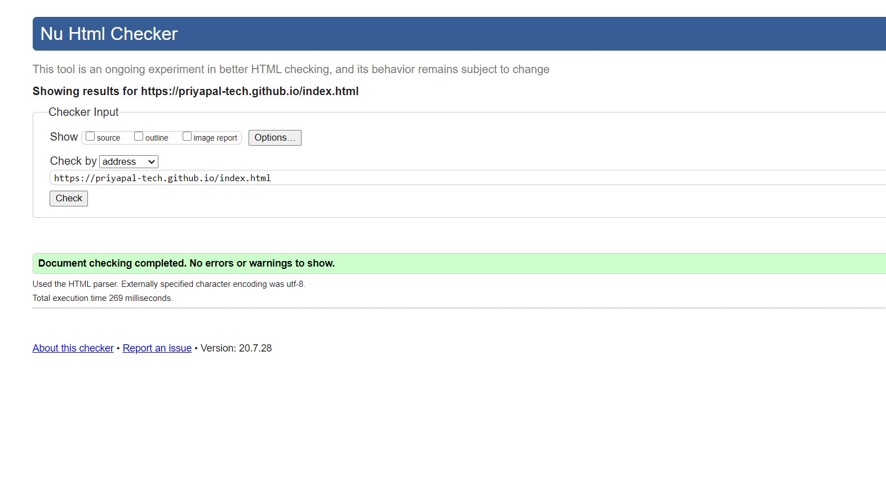

# PriyaPal-tech.github.io
Web Design for Everybody Capstone project by University of Michigan

A responsive portfolio made from scratch.  
Here is the link - https://priyapal-tech.github.io/index.html

<h2>Portfolio</h2><ul>
<li>Developed a professional-quality web portfolio.</li>
<li>Desgined the website from scratch.</li>
<li>Built HTML structure.</li>
<li>Added CSS style.</li>
<li>Addes a lightbox with carousel.</li>
<li>Added Responsive for screens less than 768px<li/>
<li>Added JavaScript Interactivity.</li>
<li>Valdited On W3 Validator.</li></ul>

<h2>Build with</h2>
<ul>
  <li>HTML5</li>
  <li>CSS3</li>
  <li>JavaScript</li>
  <li>jQuery</li></ul>
  

<h2>Validate my site on W3 Validator</h2>

It's fully validate no errors and warnings are there.

<h2>Responsive site</h2>
<h4>Desktop View</h4>
<ul>
  <li>Navigation menu with hovering effect and highlighting the current page.</li>
  <li>Lightbox with the carousel in the project page available for sketches.</li>
  <li>For lightbox javascript and jquery are used.</li>
  <li>Hovering effect for the calligraphy with some javascript tricks.</li>
  <li>All pages are well styled and assembled.</li>
  <li>Font awesome is used to create social media links in the contact page.</li></ul>
 <h4>Mobile View(Less than 768px)</h4> 
<ul>
<li>Hamburger menu with CSS tricks of transition and animation.</li>
  <li>Hovering in the calligraphy section is not available for this view.</li>
  <li>All pages are well-styled, specifically to enhance the mobile view.</li></ul>
  <h2>Extras I use to enhance the site</h2>
  <ul>
  <li>Lightbox</li>
  <li>Carousel</li>
  <li>JavaScript</li>
  <li>Font Awesome</li>
  <li>Hamburger menu</li></ul>

